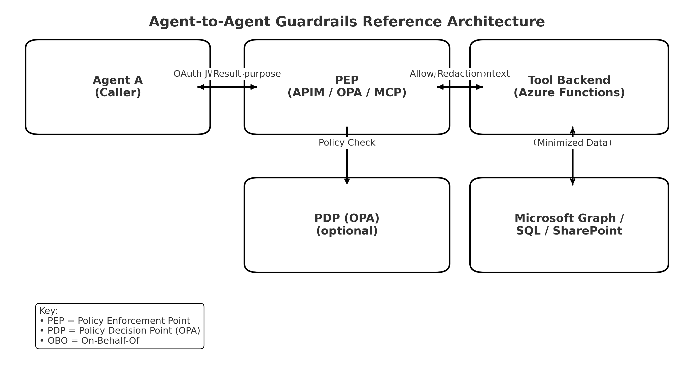

# A Practical Guide to Secure Data Sharing Between AI Agents
*Purpose-bound authorization, tool allowlists, and redaction in real systems*

**Published:** 2025-11-13

## Why Guardrails for Agent-to-Agent Data Sharing Matter (and Why They’re Hard)

Over the last year, “agentic” AI jumped from slideware to production. Calendar assistants negotiate meetings, research agents crawl internal wikis, and HR bots answer policy questions. What didn’t change is the enterprise reality underneath: data lives in many systems (Outlook, Teams, SharePoint, SQL, Jira), is governed by layered policies (privacy, compliance, need-to-know), and has **contextual** access rules (e.g., “free/busy is OK for scheduling, but never event subjects”; “project names only if we’re both members”).

In human workflows, people implicitly apply these norms. In **agent-to-agent** workflows, nothing is implicit. One agent’s “quick question” to another can silently traverse trust boundaries and create **lateral data movement** the org never intended. Three patterns make this risky:

- **Identity confusion**: The caller is an *app/agent*, but the data belongs to a *user*. Without separation, a callee can’t tell *who* is calling vs *on whose behalf* they’re acting.
- **Purpose drift**: “Show me B’s calendar” sounds benign—but is it for *scheduling* or *surveillance*? Without explicit purpose, the safest policy (“deny”) fights the business need (“schedule a meeting”).
- **Over-returning**: Calendar APIs default to rich event objects; project systems return roles and tags. Agents faithfully forward these details unless you **force minimization**.

Why this matters now:

- **Scale and speed**: Agents can exfiltrate more in minutes than a person can in weeks.
- **Visibility gaps**: Traditional DLP sees files in motion, not structured snippets returned by APIs.
- **Regulatory pressure**: Purpose limitation (GDPR), least-privilege, insider-risk controls, and data sovereignty requirements all imply **purpose-bound access**.
- **Human expectation**: Employees are OK with coworkers seeing *free/busy*. They’re not OK with coworkers seeing **titles, locations, or attendee lists**.

**Bottom line:** If agents collaborate, you need **machine-enforceable rules** for *who* may call *which tool*, *for what purpose*, and *what is safe to return*. Without them, “helpful” agents quickly become automated oversharing machines.

### Symptoms you’ll see without guardrails
- A scheduler agent returns meeting **subjects** and **locations** instead of free/busy blocks.
- A project agent reveals **roles** or **sensitive code names** to non-members.
- An HR agent answers salary questions because a caller technically has access to an HR data lake—just not for that **purpose**.
- Security teams can’t audit cross-agent data flow: logs show API hits, not **who called which tool for what reason**.

### Design goals for a sane architecture
1. **Deny by default** at the tool boundary.  
2. **Strong caller identity** (agent/app token) separate from **user identity** (delegated token for OBO).  
3. **Purpose binding**: every call declares a purpose; policies are evaluated against it.  
4. **Tool-level allow/deny lists**: explicit per-tool caller allowlists (and optional denylists).  
5. **ABAC + minimization**: enforce membership/labels; return **only what the purpose needs** (free/busy; shared project names).  
6. **Auditability and rate limiting**: log `(tool, caller_app_id, caller_oid, purpose, decision, reason)` and throttle by caller.

---

## Reference Architecture



```
[Agent A] --(HTTP with OAuth + purpose)--> [PEP] --> [Tool Backend] --> Graph/SQL/SP
                   ^                         |           |
                   |                         |           +-- ABAC (e.g., project intersection)
                   +-- identity & purpose    |           +-- redaction/minimization
                                             +-- PDP (OPA) optional
```
You can realize **[PEP]** as:
- OPA-enforced Functions (PEP inside code + external PDP), or
- API Gateway policies (PEP at the edge) - in this blog we will use Azure API Management (APIM) as example, or
- MCP server (PEP inside the tool bus).

---

## Pattern A — OPA (Rego) + Azure Functions (PEP + PDP)

**Use when:** you need fine-grained, code-reviewable policy-as-code and server-side redaction.

### Rego policy (per-tool allow/deny + purpose)
```rego
package pdp

default allow := false
default reason := "No matching policy."
default redactions := []

tool_cfg[t] := data.tool_policies[t]

caller_app_id := input.context.caller_app_id
purpose       := input.context.purpose

deny_tool_by_app { tool_cfg(input.context.tool).deny_apps[_] == caller_app_id }
allow_tool_by_app { tool_cfg(input.context.tool).allow_apps[_] == caller_app_id }

allow {  # calendar free/busy
  input.action == "read_freebusy"
  input.resource.type == "calendar"
  purpose == "meeting_scheduling"
  not deny_tool_by_app
  allow_tool_by_app
}
reason := "Free/busy only, for meeting scheduling" {
  allow
  input.action == "read_freebusy"
}

allow {  # project sharing (names only)
  input.action == "read_project_names"
  input.resource.type == "project_set"
  purpose == "project_collab"
  not deny_tool_by_app
  allow_tool_by_app
}
redactions := ["role_name"] {
  input.action == "read_project_names"
}
```

**Policy data (allowlists):**
```json
{
  "tool_policies": {
    "calendar_freebusy": {
      "allow_apps": ["<SCHEDULER_AGENT_APP_ID>", "<HR_AGENT_APP_ID>"],
      "deny_apps": []
    },
    "project_info_share": {
      "allow_apps": ["<PMO_AGENT_APP_ID>", "<HR_AGENT_APP_ID>"],
      "deny_apps": []
    }
  }
}
```

### Function PEP essentials
- Extract caller app from `Authorization` token claims (`appid` or `azp`).
- Pass `context.tool`, `context.purpose`, `context.caller_app_id` to PDP.
- If denied → **403**; if allowed → perform **OBO** and **redact** fields.

See runnable snippets in **`samples/opa`**.

---

## Pattern B — API Gateway-only (OPA-free) perimeter enforcement

**Use when:** you want fast, low-friction allow/deny at the edge, plus purpose checks and throttling.

**APIM policy (calendar op):**
```xml
<inbound>
  <validate-jwt header-name="Authorization" require-scheme="Bearer">
    <openid-config url="{AAD_OPENID_CONFIG}" />
    <audiences><audience>{AUDIENCE}</audience></audiences>
  </validate-jwt>
  <set-variable name="callerAppId" value="@(jwt.ClaimsPrincipal.Current.FindFirstValue(&quot;appid&quot;) ?? jwt.ClaimsPrincipal.Current.FindFirstValue(&quot;azp&quot;))" />
  <check-header name="x-purpose" failed-check-httpcode="403">
    <value>meeting_scheduling</value>
  </check-header>
  <choose>
    <when condition="@(new string[] { {ALLOW_APPS_CALENDAR} }.Contains((string)context.Variables[&quot;callerAppId&quot;]))" />
    <otherwise><return-response><set-status code="403" reason="Forbidden" /></return-response></otherwise>
  </choose>
  <set-header name="X-Caller-AppId" exists-action="override">
    <value>@((string)context.Variables["callerAppId"])</value>
  </set-header>
  <set-header name="X-Purpose" exists-action="override">
    <value>@((string)context.Request.Headers.GetValueOrDefault("x-purpose",""))</value>
  </set-header>
</inbound>
```

**Backend tip:** still apply **ABAC & redaction** locally (e.g., project intersection; free/busy only).  
See **`samples/apim`** for copy-paste policies.

---

## Pattern C — MCP server as the PEP (great with Semantic Kernel)

**Use when:** you want a central tool bus where you can enforce identity, purpose, ABAC, and redaction in one place.

Minimal **TypeScript MCP tool**:
```ts
const ALLOW = {
  calendar_freebusy: { apps: new Set(["<SCHEDULER_APPID>", "<HR_APPID>"]), purpose: "meeting_scheduling" },
  project_info_share: { apps: new Set(["<PMO_APPID>", "<HR_APPID>"]), purpose: "project_collab" }
};

function enforce(tool: string, callerAppId: string, purpose: string) {
  const c = (ALLOW as any)[tool];
  if (!c) throw new Error("unknown tool");
  if (!c.apps.has(callerAppId)) throw new Error("caller not allowed");
  if (c.purpose !== purpose) throw new Error("purpose mismatch");
}
```

Handlers do: **validate caller token → enforce(tool,purpose) → OBO → redact → return**.  
See runnable skeleton in **`samples/mcp-server`**.

---

## Wiring callers (Semantic Kernel / Azure AI Foundry Agents)

- **Always** send **caller token** (who’s calling) via `Authorization: Bearer`.
- **Always** send **purpose** via a header (e.g., `x-purpose`) or request field.
- **If user data**: include **user delegated token** for OBO.

**Semantic Kernel (C#) OpenAPI plugin headers:**
```cs
var execParams = new OpenApiFunctionExecutionParameters {
  HttpClient = http,
  EnableDynamicOperationPayloads = true,
  OperationHeadersFactory = async (op) => new Dictionary<string,string> {
    ["Authorization"] = $"Bearer {await GetCallerTokenAsync()}",
    ["x-purpose"] = op == "calendar_freebusy" ? "meeting_scheduling" : "project_collab"
  }
};
```

---

## Testing & Verification

- **Allowlisted caller + correct purpose** → 200 + minimal fields
- **Allowlisted caller + wrong purpose** → 403
- **Non-allowlisted caller** → 403
- **Project intersection** → only shared
- **Calendar** → never titles/locations
- **Abuse** → rate-limit kicks in

Emit structured logs with: `(tool, caller_app_id, caller_oid, purpose, decision, reason, latency)`

---

## Security hardening checklist

- Validate JWT signatures against Entra **JWKS** (caller & user tokens).  
- Use **private networking**, **managed identities**, and **Key Vault**.  
- Least-privilege SQL (stored procs only).  
- Strict **CORS**, **mTLS/IP** restrictions as needed.  
- **Deny by default** and audit all denials.  
- Purpose enforcement everywhere (APIM, OPA/MCP, backend).  
- Unit, integration, and **exfiltration** tests.  
- Rate limits/quotas per caller app.

---

## Samples & Repo

This post includes runnable snippets you can copy:

```
samples/
  opa/
    policy/pdp.rego
    policy/data.json
  apim/
    policies/calendar_policy.xml
    policies/projects_policy.xml
  mcp-server/
    src/server.ts
    src/services/graph.ts
    src/services/sql.ts
  sk-csharp/
    Program.cs
    sk-sample-csharp.csproj
    agents/personal-agent-tools.openapi.yaml
  functions-pep/
    host.json
    local.settings.json.example
    requirements.txt
    calendar_freebusy/
      __init__.py
      function.json
      shared.py
    project_info_share/
      __init__.py
      function.json
      shared.py
```
